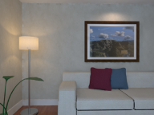

**Hint**: any commits that could affect the result should test on the benchmarks first and record experimental data!

We choose the following dataset to evaluate:

#### 1.[ETH3D](https://www.eth3d.net/)
- **Tens** of images;
- **Indoors** & **Outdoors**;
- Ground truth **Poses** & **Scans**;
- Format of the *COLMAP*;

We choose five of them:

1.1 pipes - 14 images indoors

1.2 meadow - 15 images outdoors

1.3 relief - 31 images indoors

1.4 courtyard - 38 images outdoors

1.5 facade - 76 images outdoors

For details, see https://www.eth3d.net/.

#### 2.[Tanks and Temples](https://www.tanksandtemples.org/)
- **Hundreds** of images;
- **Indoors** & **Outdoors**;
- Ground truth **Scans**;
- *COLMAP* Poses;

2.1 Caterpillar - 383 images objects

2.2 Ignatius - 263 images objects

2.3 Truck - 251 images objects

2.4 Barn - 384 images Outdoors

2.5 Church - 600 images Indoors

2.6 Meetingroom - 371 images Indoors

2.7 Courthouse - 1106 images Outdoors

For details, see https://www.tanksandtemples.org/download/.

#### 3.[ICL-NUIM](http://www.doc.ic.ac.uk/~ahanda/VaFRIC/iclnuim.html)

Choose the Living Room Dataset

- **Thousands** of images;
- **Indoor**
- Ground truth **Poses** & **Surfaces**;

Four video for one living room:

3.1 video0 - 1509 images Indoors

3.2 video1 - 966 images Indoors

3.3 video2 - 882 images Indoors

3.4 video3 - 1241 images Indoors

For details, see http://www.doc.ic.ac.uk/~ahanda/VaFRIC/iclnuim.html.

#### 4.[KITTI](http://www.cvlibs.net/datasets/kitti/eval_odometry.php)

- **Large-scale** **outdoors**;
- Ground truth **Poses**;

For details, see http://www.cvlibs.net/datasets/kitti/eval_odometry.php.